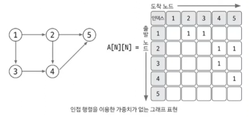
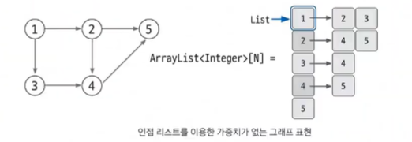
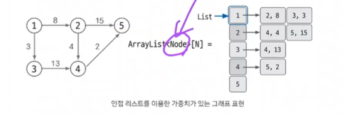

## 그래프

- 노드와 에지로 구성된 집합
  - 노드 : 데이터를 표현하는 단위
  - 에지 : 노드를 연결


- [유니온 파인드](#유니온-파인드)
- [위상 정렬](#위상-정렬)
- [다익스트라](#다익스트라-최단-거리-알고리즘1)
- [벨만-포드](#벨만-포드-최단-거리-알고리즘2)
- [플로이드-워셜](#플로이드-워셜-최단-거리-알고리즘3)
- [최소 신장 트리](#최소-신장-트리-mst)

<br>

### ⭐ 그래프의 표현

- 그래프 구현 방법 3가지
  1. 에지 리스트
  2. 인접 행렬
  3. ⭐ 인접 리스트

#### 1. 에지 리스트

에지를 중심으로 그래프를 표현

- 에지 리스트로 가중치 없는 그래프 표현하기 → 배열 행 2개
- 에지 리스트로 가중치 있는 그래프 표현하기 → 배열 행 3개 (가중치 행 추가)

#### 2. 인접 행렬

2차원 배열을 자료구조로 이용하여 그래프를 표현

- 노드와 관련된 에지를 탐색하려면 N 번 접근해야 하므로 노드 개수에 비해 에지가 적을 때는 공간 효율성이 떨어진다


- 인접 행렬로 가중치 없는 그래프 표현하기 → 1을 저장



- 인접 행렬로 가중치 있는 그래프 표현하기 → 가중치 저장

#### ⭐ 3. 인접 리스트

제일 많이 사용되는 방법  
노드 개수만큼 ArrayList 선언

- 노드와 연결되어 있는 에지를 탐색하는 시간이 매우 뛰어남
- 노드 개수가 커도 공간 효율이 좋아 메모리 초과 에러도 발생하지 않는다


- 인접 리스트로 가중치 없는 그래프 표현하기



- ⭐ 인접 리스트로 가중치 있는 그래프 표현하기


<br>

### 유니온 파인드

- 사이클 유무 판단

그래프의 사이클이 생성되는지 판별하는 알고리즘

```text
유니온 파인드는 일반적으로 여러 노드가 있을 때 특정 노드 2개를 연결해 1개의 집합으로 묶는 union 연산과
두 노드가 같은 집합에 속해 있는지를 확인하는 find 연산으로 구성되어 있는 알고리즘이다.

find 연산 : 자신이 속한 집합의 대표 노드를 찾아줌
         - 그래프 정돈, 시간 복잡도 향상
```
<br>

##### 유니온 파인드 원리
1. 1차원 배열(대표 노드 저장 배열) 초기화
   - 자신의 인덱스값으로 초기화
2. union 연산
  
  - ⭐ union : 항상 대표 노드끼리 연결해준다 !!
    - 대표 노드 찾는 방법 → find 연산

<br>

##### find 연산 작동 원리
1. 대상 노드 배열에 index 값과 value 값이 동일한지 확인
2. 동일하지 않으면 value 값이 가리키는 index 위치로 이동
3. 이동 위치의 index 값과 value 값이 같을 때까지 1~2 를 반복 (재귀 함수)
4. 대표 노드 도달 시 재귀 함수를 빠져나오면서 거치는 모든 노드값을 루트 노드값으로 변경
  
➡️ 경로 압축은 실제 그래프에서 여러 노드를 거쳐야 하는 경로에서 그래프를 변형해 
더 짧은 경로로 갈 수 있도록 함으로써 시간 복잡도를 효과적으로 줄이는 방법이다.

<br>

### 위상 정렬

- 조건 1. 사이클이 없음  
- 조건 2. 방향이 있는 그래프

노드를 정렬해주는 알고리즘 (정렬 결과가 1개가 아닐 수도 있다)  

문제 예시) 수강신청, 전후관계가 있는(방향이 있는)

```text
위상 정렬은 사이클이 없는 방향 그래프에서 노드 순서를 찾는 알고리즘
기능 : 노드 간의 순서를 결정
특징 : 사이클이 없어야 함
시간 복잡도 : O(V+E)
```
<br>

#### 위상 정렬의 핵심 이론
1. 진입 차수 : 자기 자신을 가리키는 에지의 개수
   - 주어진 그래프 → 인접 리스트 → 진입 차수 배열
2. 진입 차수가 0인 노드 선택 → 위상 정렬 배열에 저장 → 선택된 노드가 인접 리스트에서 가리키는 노드들의 진입 차수 -1

<br>

### 다익스트라 (최단 거리 알고리즘1)

S 라는 시작점에서(고정된 시작점) 다른 모든 노드로 가는 최단 거리를 구하는 알고리즘  
단, 음수 간선은 존재해서는 안된다

```text
다익스트라 알고리즘은 그래프에서 최단 거리를 구하는 알고리즘
기능 : 출발 노드와 모든 노드 간 최단 거리 탐색
특징 : 에지가 모두 양수
시간 복잡도 : O(ElogV)
```
<br>

#### 다익스트라 알고리즘의 핵심 이론 
1. 인접 리스트로 그래프 구현
2. 최단 거리 배열 초기화
   - 출발 노드 : 0, 이외의 노드 : 무한
3. 최단 거리 배열에서 값이 가장 작은 노드 선택
4. 최단 거리 배열 업데이트
   - Min(선택 노드의 최단 거리 배열의 값 + 에지 가중치, 연결 노드의 최단 거리 배열의 값)
5. 3~4 번 반복
   - 다시 선택되지 않도록 방문 배열 만들기

<br>

### 벨만-포드 (최단 거리 알고리즘2)

S 라는 시작점에서(고정된 시작점) 다른 모든 노드로 가는 최단 거리를 구하는 알고리즘  
음수 간선도 가능하다  

음수 사이클이 있는지 체크하는 문제가 더 많이 나온다  
ex) 시간 여행, 웜홀

<br>

### 플로이드-워셜 (최단 거리 알고리즘3)

시작점이 없다  
임의의 모든 노드에 대해 최단 거리를 구한다  
다익스트라, 벨만-포드에 비해 시간 복잡도가 안좋다  

ex) 모든 도시 간 최단 거리 (+ N 이 작아야 함)

<br>

### 최소 신장 트리 (MST)

그래프에서 최소의 가중치의 합으로 모든 노드를 연결할 수 있게 해주는 알고리즘  
유니온 파인드를 이용 (사이클이 없어야 하는 조건 검사)

---
<br>

#### 1707 이분 그래프 판별하기

```text
이분 그래프 : 각 집합에 속한 노드끼리 서로 인접하지 않은 두 집합으로 그래프의 노드를 나눌 수 있다

트리는 항상 이분 그래프 (사이클이 발생하지 않음)

1. 인접 리스트로 구현 (가중치 X)
2. 모든 노드에 DFS 탐색 알고리즘 적용
    현재 노드에서 연결된 노드 중 이미 방문한 노드가 나와 같은 집합이면 이분 그래프가 아닌 것으로 판별
    이분 그래프가 아니면 이후 노드는 탐색하지 않음

※ 모든 노드에 DFS 탐색하는 이유 : 그래프의 모든 노드가 이어져 있지 않고, 여러 개의 부분 그래프로 이뤄진 케이스가 존재할 수 있기 때문

- check : 이분 그래프 체크 배열
- A : 그래프 데이터 저장 인접 리스트
- visited : 방문 기록 저장 배열
```
```java
import java.util.*;
import java.io.*;
public class Main {
    static ArrayList<Integer>[] A;
    static int[] check;
    static boolean[] visited;
    static boolean IsEven;
    public static void main(String[] args) throws IOException {
        BufferedReader br = new BufferedReader(new InputStreamReader(System.in));
        int testCase = Integer.parseInt(br.readLine());
        for (int t = 0; t < testCase; t++) {
            // 주어진 테스트 케이스 만큼 돌림
            String[] s = br.readLine().split(" ");
            int V = Integer.parseInt(s[0]);
            int E = Integer.parseInt(s[1]);
            A = new ArrayList[V+1];
            visited = new boolean[V+1];
            check = new int[V+1];
            IsEven = true;
            for (int i = 1; i <= V; i++) {
                A[i] = new ArrayList<Integer>();
            }
            
            // edge 데이터 저장하기
            for (int i = 0; i < E; i++) {
                s = br.readLine().split(" ");
                int start = Integer.parseInt(s[0]);
                int end = Integer.parseInt(s[1]);
                A[start].add(end);
                A[end].add(start);
            }
            
            // 모든 노드에서 DFS 실행
            for (int i = 1; i <= V; i++) {
                if (IsEven) {
                    DFS(i);
                } else {
                    break;
                }
            }
            
            if (IsEven) System.out.println("YES");
            else System.out.println("NO");
        }
    }
    private static void DFS(int start) {
        visited[start] = true;
        for (int i : A[start]) {
            // 인접 리스트로 받아서 start 에서 연결된 모든 노드 탐색
            if (!visited[i]) {
                // 집합 분류
                check[i] = (check[start] + 1) % 2;
                DFS(i);
            } else {
                if (check[start] == check[i]) {
                    IsEven = false;
                }
            }
        }
    }
}
```
<br>

#### 1717 집합의 표현
```text
합집합 연산 → union
두 원소가 같은 집합에 포함돼 있는지 확인하는 연산 → find (대표 노드 찾기)
➡️ union find

최대 원소 개수 1,000,000과 질의 개수 100,000이 큰 편이므로 경로 압축이 필요한 전형적인 유니온 파인드 문제

1. 데이터셋 초기화
    - 각 노드의 대표 노드는 자기 자신
2. union
    - find 연산으로 특정 노드의 대표 노드 찾기
    
⭐ 주의할 점
- find 연산의 재귀 함수에서 나오면서 탐색한 모든 노드의 대표 노드값을 이번 연산에서 발견한 대표 노드로 변경하기
- union 연산에서 선택된 노드끼리 연결하는 것이 아닌 선택된 노드의 대표 노드끼리 연결하기
```
```java
public class Main {
    static int parent[];
    public static void main(String[] args) {
        Scanner sc = new Scanner(System.in);
        int N = sc.nextInt();
        int M = sc.nextInt();
        parent = new int[N+1];
        for (int i = 0; i < N+1; i++) { // 대표 노드 초기화
            parent[i] = i;
        }
        
        for (int i = 0; i < M; i++) { // 질의 계산하는 부분
            int question = sc.nextInt();
            int a = sc.nextInt();
            int b = sc.nextInt();
            if (question == 0) { // union
                union(a,b);
            } else { // 두 원소 같은지 보기
                boolean result = checkSame(a, b);
                if (result) {
                    System.out.println("YES");
                } else {
                    System.out.println("NO");
                }
            }
        }
    }
    
    private static void union(int a, int b) {
        // 대표 노드 찾아서 연결하기
        a = find(a);
        b = find(b);
        if (a != b) {
            parent[b] = a; // 두 개 연결
        }
    }
    
    private static int find(int a) {   
        if (a == parent[a]) return a;
        else {
            return parent[a] = find(parent[a]); // value 를 index 로 바꿔서 또 찾아보기
        }
    }
    
    private static boolean checkSame(int a, int b) {
        a = find(a);
        b = find(b);
        if (a == b) return true;
        return false;
    }
}
```
<br>

#### 2522 줄 세우기
```text
학생들을 노드로 생각하고, 키 순서 비교 데이터로 에지를 만든다고 생각했을 때 노드의 순서를 도출하는 가장 기본적인 문제

💡 위상 정렬 힌트 💡 
`답이 여러 가지일 경우에는 아무거나 출력한다`

1. 인접 리스트에 노드 데이터 저장, 진입 차수 배열값 업데이트
2. 진입 차수가 0인 노드 큐에 저장
3. 큐에서 데이터를 poll → 해당 노드를 탐색 결과에 추가 → 해당 노드가 가리키는 노드의 진입 차수를 1씩 감소
4. 감소했을 때 진입 차수가 0이 되는 노드를 큐에 offer
5. 큐가 빌 때까지 2~4 반복
```

```java
public class Main {
    public static void main(String[] args) {
        Scanner sc = new Scanner(System.in);
        int N = sc.nextInt();
        int M = sc.nextInt();
        ArrayList<ArrayList<Integer>> A = new ArrayList<>();
        for (int i = 0; i <= N; i++) {
            A.add(new ArrayList<>());
        }
        int indegree[] = new int[N+1];
        for (int i = 0; i < M; i++) {
            int S = sc.nextInt();
            int E = sc.nextInt();
            A.get(S).add(E);
            indegree[E]++; // 진입차수 배열 데이터 저장 부분
        }
        
        // 위상정렬 실행
        Queue<Integer> queue = new LinkedList<>();
        for (int i = 1; i <= N; i++) {
            if (indegree[i] == 0) {
                queue.offer(i);
            }
        }
        
        while (!queue.isEmpty()) {
            int now = queue.poll();
            System.out.println(now + " ");
            for (int next : A.get(now)) {
                indegree[next]--;
                if (indegree[next]==0) {
                    queue.offer(next);
                }
            }
        }
    }
}
```