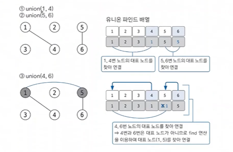

## 그래프

- 노드와 에지로 구성된 집합
  - 노드 : 데이터를 표현하는 단위
  - 에지 : 노드를 연결


- [유니온 파인드](#유니온-파인드)
- [위상 정렬](#위상-정렬)
- [다익스트라](#다익스트라-최단-거리-알고리즘1)
- [벨만-포드](#벨만-포드-최단-거리-알고리즘2)
- [플로이드-워셜](#플로이드-워셜-최단-거리-알고리즘3)
- [최소 신장 트리](#최소-신장-트리-mst)

### ⭐ 그래프의 표현

- 그래프 구현 방법 3가지
  1. 에지 리스트
  2. 인접 행렬
  3. ⭐ 인접 리스트

#### 1. 에지 리스트

에지를 중심으로 그래프를 표현

- 에지 리스트로 가중치 없는 그래프 표현하기 → 배열 행 2개
- 에지 리스트로 가중치 있는 그래프 표현하기 → 배열 행 3개 (가중치 행 추가)

#### 2. 인접 행렬

2차원 배열을 자료구조로 이용하여 그래프를 표현

- 노드와 관련된 에지를 탐색하려면 N 번 접근해야 하므로 노드 개수에 비해 에지가 적을 때는 공간 효율성이 떨어진다


- 인접 행렬로 가중치 없는 그래프 표현하기 → 1을 저장


- 인접 행렬로 가중치 있는 그래프 표현하기 → 가중치 저장

#### ⭐ 3. 인접 리스트

제일 많이 사용되는 방법  
노드 개수만큼 ArrayList 선언

- 노드와 연결되어 있는 에지를 탐색하는 시간이 매우 뛰어남
- 노드 개수가 커도 공간 효율이 좋아 메모리 초과 에러도 발생하지 않는다


- 인접 리스트로 가중치 없는 그래프 표현하기


- ⭐ 인접 리스트로 가중치 있는 그래프 표현하기


### 유니온 파인드

- 사이클 유무 판단

그래프의 사이클이 생성되는지 판별하는 알고리즘

```text
유니온 파인드는 일반적으로 여러 노드가 있을 때 특정 노드 2개를 연결해 1개의 집합으로 묶는 union 연산과
두 노드가 같은 집합에 속해 있는지를 확인하는 find 연산으로 구성되어 있는 알고리즘이다.

find 연산 : 자신이 속한 집합의 대표 노드를 찾아줌
         - 그래프 정돈, 시간 복잡도 향상
```
<br>

##### 유니온 파인드 원리
1. 1차원 배열(대표 노드 저장 배열) 초기화
   - 자신의 인덱스값으로 초기화
2. union 연산
  
  - ⭐ union : 항상 대표 노드끼리 연결해준다 !!
    - 대표 노드 찾는 방법 → find 연산

<br>

##### find 연산 작동 원리
1. 대상 노드 배열에 index 값과 value 값이 동일한지 확인
2. 동일하지 않으면 value 값이 가리키는 index 위치로 이동
3. 이동 위치의 index 값과 value 값이 같을 때까지 1~2 를 반복 (재귀 함수)
4. 대표 노드 도달 시 재귀 함수를 빠져나오면서 거치는 모든 노드값을 루트 노드값으로 변경
  
➡️ 경로 압축은 실제 그래프에서 여러 노드를 거쳐야 하는 경로에서 그래프를 변형해 
더 짧은 경로로 갈 수 있도록 함으로써 시간 복잡도를 효과적으로 줄이는 방법이다.

### 위상 정렬

- 조건 1. 사이클이 없음  
- 조건 2. 방향이 있는 그래프

노드를 정렬해주는 알고리즘 (정렬 결과가 1개가 아닐 수도 있다)  

문제 예시) 수강신청, 전후관계가 있는(방향이 있는)

### 다익스트라 (최단 거리 알고리즘1)

S 라는 시작점에서(고정된 시작점) 다른 모든 노드로 가는 최단 거리를 구하는 알고리즘  
단, 음수 간선은 존재해서는 안된다

### 벨만-포드 (최단 거리 알고리즘2)

S 라는 시작점에서(고정된 시작점) 다른 모든 노드로 가는 최단 거리를 구하는 알고리즘  
음수 간선도 가능하다  

음수 사이클이 있는지 체크하는 문제가 더 많이 나온다  
ex) 시간 여행, 웜홀

### 플로이드-워셜 (최단 거리 알고리즘3)

시작점이 없다  
임의의 모든 노드에 대해 최단 거리를 구한다  
다익스트라, 벨만-포드에 비해 시간 복잡도가 안좋다  

ex) 모든 도시 간 최단 거리 (+ N 이 작아야 함)

### 최소 신장 트리 (MST)

그래프에서 최소의 가중치의 합으로 모든 노드를 연결할 수 있게 해주는 알고리즘  
유니온 파인드를 이용 (사이클이 없어야 하는 조건 검사)
