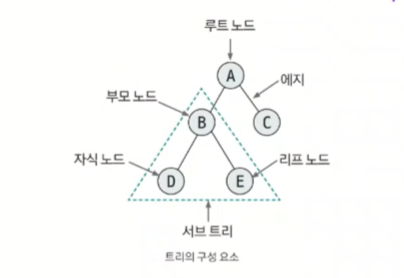

## 트리

트리는 노드와 에지로 연결된 그래프의 특수한 형태  
= 그래프의 표현으로 트리를 표현할 수 있다!

### 트리의 특징
- 순환 구조를 지니고 있지 않고, 1개의 루트 노드가 존재
- 루트 노드를 제외한 노드는 단 1개의 부모 노드를 갖는다
- 트리의 부분 트리 역시 트리의 모든 특징을 따른다

⭐ 트리에서 임의의 두 노드를 이어주는 경로는 유일하다

### 트리의 핵심 이론
  
- 노드 : 데이터의 index와 value를 표현하는 요소  
- 에지 : 노드와 노드의 연결 관계를 나타내는 선  
- 루트 노드 : 트리에서 가장 상위에 존재하는 노드  
- 부모 노드 : 두 노드 사이의 관계에서 상위 노드에 해당하는 노드  
- 자식 노드 : 두 노드 사이의 관계에서 하위 노드에 해당하는 노드  
- 리프 노드 : 트리에서 가장 하위에 존재하는 노드 (자식 노드가 없음)  
- 서브 트리 : 전체 트리에 속한 작은 트리  

### 코딩테스트 팁 !!
```text
코딩테스트에서 tree

1. 그래프로 푸는 tree
(i) 노드와 에지를 인접 리스트로 표현
(ii) DFS, BFS

2. ⭐ tree 만을 위한 문제
-> 이진 트리 & 세그먼트 트리(index tree) & LCA(최소공통조상)

⭐ 세그먼트 트리
⭐ LCA
=> 1차원 배열로 tree 표현
```