## 트리

트리는 노드와 에지로 연결된 그래프의 특수한 형태  
= 그래프의 표현으로 트리를 표현할 수 있다!

### 트리의 특징
- 순환 구조를 지니고 있지 않고, 1개의 루트 노드가 존재
- 루트 노드를 제외한 노드는 단 1개의 부모 노드를 갖는다
- 트리의 부분 트리 역시 트리의 모든 특징을 따른다

⭐ 트리에서 임의의 두 노드를 이어주는 경로는 유일하다

### 트리의 핵심 이론
  
- 노드 : 데이터의 index와 value를 표현하는 요소  
- 에지 : 노드와 노드의 연결 관계를 나타내는 선  
- 루트 노드 : 트리에서 가장 상위에 존재하는 노드  
- 부모 노드 : 두 노드 사이의 관계에서 상위 노드에 해당하는 노드  
- 자식 노드 : 두 노드 사이의 관계에서 하위 노드에 해당하는 노드  
- 리프 노드 : 트리에서 가장 하위에 존재하는 노드 (자식 노드가 없음)  
- 서브 트리 : 전체 트리에 속한 작은 트리  

### 코딩테스트 팁 !!
```text
코딩테스트에서 tree

1. 그래프로 푸는 tree
(i) 노드와 에지를 인접 리스트로 표현
(ii) DFS, BFS

2. ⭐ tree 만을 위한 문제
-> 이진 트리 & 세그먼트 트리(index tree) & LCA(최소공통조상)

⭐ 세그먼트 트리
⭐ LCA
=> 1차원 배열로 tree 표현
```

## ⭐ 이진 트리
**이진 트리는 각 노드의 자식 노드의 개수가 2 이하로 구성된 트리**  
<br>

#### 이진 트리의 핵심 이론
##### 1. 이진 트리 종류  
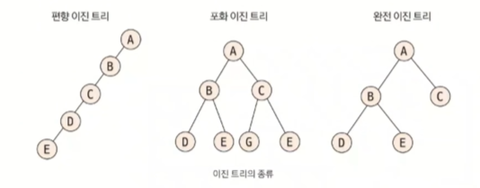  
- 편향 이진 트리 : 노드들이 한쪽으로 편향  
  → 탐색 속도 저하, 공간 낭비
- 포화 이진 트리 : 트리 높이가 모두 일정하며 리프 노드가 꽉 참
- 완전 이진 트리 : 마지막 레벨을 제외하고 노드들이 채워져 있음 (마지막 레벨은 왼쪽부터 채워짐)  
  → 일반적인 코딩 테스트 트리 (LCA, index tree)

<br>

##### 2. 이진 트리 순차 표현  
'**배열**' : 가장 직관적이면서 편리한 트리 자료구조  

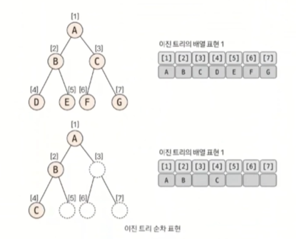  
⭐ 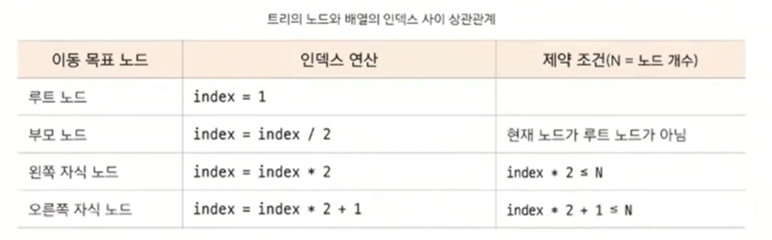  
→ 세그먼트 트리, LCA 알고리즘에서 기본이 되는 연산

<br>

## 세그먼트 트리
주어진 데이터의 구간 합과 데이터 업데이트를 빠르게 수행하기 위해 고안해낸 자료구조의 형태  
→ 더 큰 범위로 '인덱스 트리'라 불림 (코딩 테스트에는 큰 차이가 없다)  

```text
구간 합 = 합 배열로 구할 수 있다
합 배열의 문제점 : 데이터 업데이트가 빈번하게 일어나면 성능이 안좋아진다

➡️ 세그먼트 트리 사용
```
<br>

#### 세그먼트 트리의 핵심 이론
세그먼트 트리 종류 : 구간 합, 최대/최소 구하기  
구현 단계 : 트리 초기화, 질의값 구하기(구간 합, 최대/최소), 데이터 업데이트  

##### 1. 트리 초기화하기
   - 데이터는 리프 노드에만 들어있다
   - 리프 노드의 개수가 데이터의 개수(N) 이상이 되도록 트리 배열 만들기
   - ⭐ 트리 배열의 크기 구하는 방법 : 2^k >= N 을 만족하는 k 최솟값 구한 후 2^k *2 를 트리 배열의 크기로 정한다
     - ex) N=8 → 2^3 >= 8 → 배열 크기 : 2^3 *2 = 16
     - 시작 인덱스 : 2^k
   - 리프 노드를 제외한 나머지 노드 값 채우기 (2^k - 1 부터 1번 쪽으로)

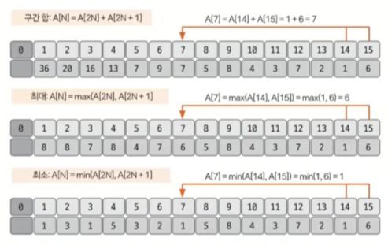
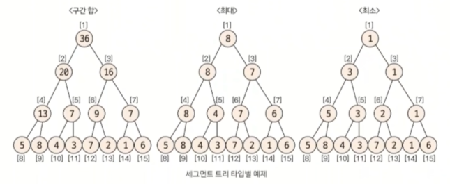  

<br>

##### 2. 질의값 구하기
   - 주어진 질의 인덱스를 세그먼트 트리의 리프 노드에 해당하는 인덱스로 변경
   - ex) Q. 인덱스 1-4 까지의 구간합을 구해주세요 → 세그먼트 트리 리프 노드 8-11 인덱스로 변경
   - 질의 인덱스를 세그먼트 트리 인덱스로 변경하는 방법 : 세그먼트 트리 인덱스 = 주어진 질의 인덱스 + 2^k - 1
   - 질의값 구하는 과정
     - (i) start_index % 2 == 1 일 때 해당 노드 선택
     - (ii) end_index % 2 == 0 일 때 해당 노드 선택
     - (iii) start_index depth 변경 : start_index = (start_index + 1) / 2
     - (iv) end_index depth 변경 : end_index = (end_index - 1) / 2
     - (v) 위의 과정 반복하다가 end_index < start_index 시 종료

```text
(i)(ii) 에서 해당 노드를 선택했다는 것은 해당 노드의 부모가 나타내는 범위가 질의 범위를 넘어가기 때문에 
해당 노드를 질의값에 영향을 미치는 독립 노드로 선택하고, 해당 노드의 부모 노드는 대상 범위에서 제외한다는 뜻이다.

부모 노드를 대상 범위에서 제거하는 방법은 바로 (iii)(iv) 에서 질의 범위에 해당하는 부모 노드로 이동하기 위해 
인덱스 연산을 index/2 가 아닌 (index+1)/2, (index-1)/2 로 수행하는 것이다.

질의에 해당하는 노드를 선택하는 방법은 구간 합, 최댓값 구하기, 최솟값 구하기 모두 동일하며
선택된 노드들에 관해 마지막에 연산하는 방식만 다르다.

질의에 해당하는 노드 선택 방법
- 구간 합 : 선택된 노드를 모두 더한다
- 최댓값 구하기 : 선택된 노드 중 MAX값을 선택해 출력한다
- 최솟값 구하기 : 선택된 노드 중 MIN값을 선택해 출력한다
```
<br>

⭐ (예제) 2~6 구간합 구하기  
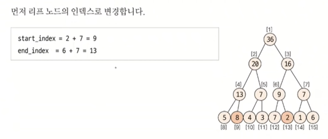  
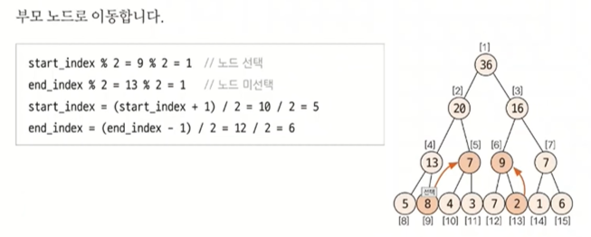  
- start_index % 2 == 1 ➡️ 시작 리프 노드가 오른쪽 자식 노드라는 뜻 (부모 노드가 대표값이 되지 못하므로 해당 노드를 독립 노드로 선택한다는 뜻)
- end_index % 2 == 0 ➡️ 선택된 마지막 리프 노드가 왼쪽 자식 노드라는 뜻 (부모 노드가 대표값이 되지 못하므로 해당 노드를 독립 노드로 선택한다는 뜻)

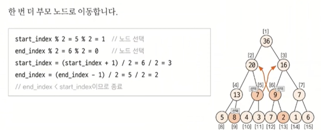  
- 2~6번 구간 합 = 선택된 노드의 합 : 8 + 9 + 7 = 24  
<br>

##### 3. 데이터 업데이트하기
- 부모 노드로 이동하는 방식 : index = index/2 (세그먼트 트리 = 이진 트리)
- 구간 합 : 원래 데이터와 변경 데이터의 차이만큼 부모 노드로 올라가면서 변경
- 최댓값 찾기 : 변경 데이터와 자신과 같은 부모를 지니고 있는 다른 자식 노드와 비교해 더 큰 값으로 업데이트 (업데이트가 일어나지 않으면 종료)
- 최솟값 찾기 : 변경 데이터와 자신과 같은 부모를 지니고 있는 다른 자식 노드와 비교해 더 작은 값으로 업데이트 (업데이트가 일어나지 않으면 종료)

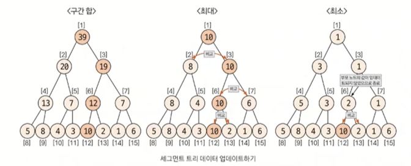

<br>

## 최소 공통 조상 (LCA)
트리 그래프에서 임의의 두 노드를 선택했을 때 두 노드가 각각 자신을 포함해 거슬러 올라가면서 
부모 노드를 탐색할 때 처음 공통으로 만나게 되는 부모 노드  

LCA 구하는 방법 1. 일반적 방법 ⬅️⬅️  
LCA 구하는 방법 2. 빠르게 찾는 방법  

#### 최소 공통 조상의 핵심 이론
##### 1. 일반적인 최소 공통 조상 구하기
- 트리의 높이가 크지 않을 때 ➡️ 시간 제한

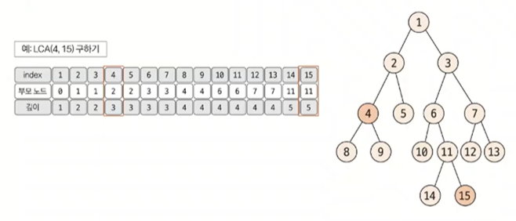  
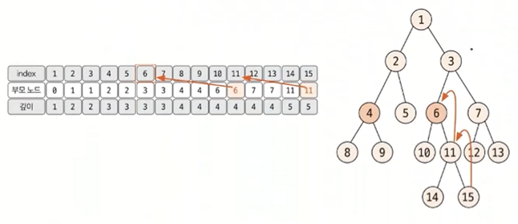  
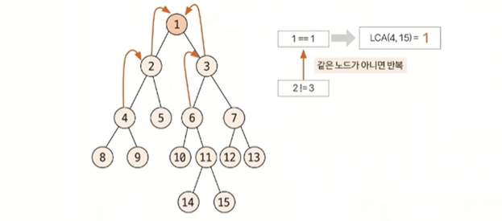  
```text
(i) 루트 노드에서 탐색(DFS/BFS) 시작 → 각 노드의 **부모 노드**와 **깊이** 저장

> 트리라는 특징 <
1. 바로 직전 탐색 노드 = 부모 노드
2. ⭐ depth 구하기 가능

(ii) 선택된 두 노드의 깊이가 다른 경우, 더 깊은 노드의 노드를 부모 노드로 1개씩 올려 주면서 같은 깊이로 맞춘다
이때 두 노드가 같으면 해당 노드가 최소 공통 조삼이므로 탐색 종료

(iii) 깊이가 같은 상태에서는 동시에 부모 노드로 올라가면서 두 노드가 같은 노드가 될 때까지 반복
```

위와 같은 방식을 이용하면 최소 공통 조상을 구할 수 있지만, 트리의 높이가 커질 경우 시간 제약 문제가 생긴다. 
'최소 공통 조상 빠르게 구하기' 로 이러한 문제를 해결할 수 있다. 
'최소 공통 조상 빠르게 구하기' 는 일반적인 최소 공통 조상 구하기 알고리즘을 약간 변형한 형태이므로 
'일반적인 구하기' 원리를 정확하게 학습한 후 '빠르게 구하기' 부분을 학습하는 것이 좋다.

---

#### 1991 트리 순회하기

```text
⭐ A 가 항상 루트 노드
💫 재귀 함수

특별한 아이디어를 떠올릴 필요 없이 문제가 요구하는 자료구조 형태만 충실히 구현하는 문제
주어진 입력값을 트리 형태의 자료구조에 적절하게 저장하고, 탐색을 수행하는 로직 구현

🔧 2차원 배열로 풀어보자
1. 2차원 배열에 트리 데이터 저장
2. 전위 순회 함수 구현 : 현재 → 왼쪽 → 오른쪽
3. 2와 같은 방법으로 중위 순회, 후위 순회 함수 구현
```

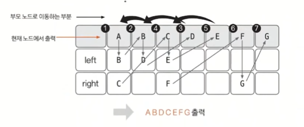  
⬆️ 전위 순회

```text
#include <iostream>
using namespace std;

static int n;
static int tree[26][2]; // 알파벳 26개

void preOrder(int now);
void inOrder(int now);
void postOrder(int now);

int main() {
    // 시간 복잡도 해결
    ios::sync_with_stdio(false);
    cin.tie(NULL);
    cout.tie(NULL);
    
    // 노드 개수 입력
    cin >> n;
    
    for (int i = 0; i < n; i++) {
        char node_char, left, right;
        cin >> node_char >> left >> right;
        int node = node_char - 'A'; // A 가 들어오면 node 값은 0 => 인덱스 역할
        
        if (left == '.') { // 자식 노드 없을 때 -1 입력
            tree[node][0] = -1;
        } else {
            tree[node][0] = left - 'A';
        }
        
        if (right == '.') { // 자식 노드 없을 때 -1 입력
            tree[node][1] = -1;
        } else {
            tree[node][1] = right - 'A';
        }
    }
    
    preOrder(0);
    cout << "\n";
    inOrder(0);
    cout << "\n";
    postOrder(0);
    cout << "\n";
}

void preOrder(int now) { // 현재 → 왼쪽 → 오른쪽
    if (now == -1) return;
    cout << (char)(now + 'A'); // 현재 노드 출력 - 출력은 다시 문자형으로 (인덱스로 저장되어 있었음)
    preOrder(tree[now][0]); // 왼쪽 노드 탐색
    preOrder(tree[now][1]); // 오른쪽 노드 탐색
}
void inOrder(int now) { // 왼쪽 → 현재 → 오른쪽
    if (now == -1) return;
    inOrder(tree[now][0]); // 왼쪽 노드 탐색
    cout << (char)(now + 'A'); // 현재 노드 출력 - 출력은 다시 문자형으로 (인덱스로 저장되어 있었음)
    inOrder(tree[now][1]); // 오른쪽 노드 탐색
}
void postOrder(int now) { // 왼쪽 → 오른쪽 → 현재
    if (now == -1) return;
    postOrder(tree[now][0]); // 왼쪽 노드 탐색
    postOrder(tree[now][1]); // 오른쪽 노드 탐색
    cout << (char)(now + 'A'); // 현재 노드 출력 - 출력은 다시 문자형으로 (인덱스로 저장되어 있었음)
}
```
<br>

#### 11437 LCA

```text
N (2<=N<=50000)
M (1<=M<=10000)

💫 루트는 1번이다
두 노드의 가장 가까운 공통 조상이 몇 번인지 출력하기

➡️ LCA

비교적 데이터가 크지 않아 일반적인 방식의 LCA 알고리즘으로 구현하면 되는 문제

1. 부노 노드 & 깊이 구하기
    (i) 인접 리스트로 트리 데이터 구현
    (ii) 탐색 알고리즘(DFS, BFS)을 이용하여 각 노드의 부모 노드 & 깊이 구하기
    
2. 깊이 맞추기
    (i) 더 깊은 노드를 같은 깊이가 될 때까지 부모 노드로 이동

3. 최소 공통 조상 찾기
    (i) 같은 부모 노드가 나올 때까지 계속 올라가기
    
🔧 슈도 코드 🔧
- tree : 인접 리스트 자료 구조
- N : 수의 개수
- M : 질의 수
- depth : 노드 깊이 배열
- parent : 노드 조상 배열
- visited : 방문 여부 저장 배열

for (N-1 반복) { 인접 리스트 tree 에 그래프 데이터 저장 }

BFS(1) // 깊이와 부모 노드를 BFS 를 통해 구하기

for (M 반복) { a(1번 노드), b(2번 노드), executedLCA(함수 호출 및 결과값 출력) }

executedLCA(1번 노드, 2번 노드) {
    1번 노드(a) 깊이가 더 작으면 1번 노드(a)와 2번 노드(b) SWAP
    // a를 부모 노드로 변경하는 작업을 두 노드 높이가 같아질 때까지 반복
    두 노드 깊이 동일하게 맞추기
    두 노드의 조상이 같을 때까지 두 노드를 각 노드의 부모 노드로 변경하는 작업 반복
    최저 공통 조상 반환
}
```
```text
#include <iostream>
#include <vector>
#include <queue>
using namespace std;

static int N, M;
static vector<vector<int>> tree;
static vector<int> depth;
static vector<int> parent;
static vector<bool> visited;

void BFS(int node);
int executeLCA(int a, int b);

int main() {
    // 시간 복잡도 줄이기
    ios::sync_with_stdio(false);
    cin.tie(NULL);
    cout.tie(NULL);
    
    cin >> N;
    
    tree.resize(N+1);
    depth.resize(N+1);
    parent.resize(N+1);
    visited.resize(N+1);
    
    for (int i = 0; i < N-1; i++) {
        int s, e;
        cin >> s >> e;
        tree[s].push_back(e);
        tree[e].push_back(s);
    }
    
    BFS(1); // 루트 노드가 1
    
    cin >> M;
    
    for (int i = 0; i < M; i++) {
        int a, b;
        cin >> a >> b;
        int LCA = executeLCA(a,b);
        cout << LCA << "\n";
    }
}

int executeLCA(int a, int b) {
    if (depth[a] < depth[b]) {
        int temp = a;
        a = b;
        b = temp;
    }
    // depth 맟주기
    while(depth[a] != depth[b]) {
        a = parent[a];
    }
    // 같은 조상이 나올 때까지 두 노드가 함께 한 칸씩 올라가기
    while(a != b) {
        a = parent[a];
        b = parent[b];
    }
    return a;
}

void BFS(int node) {
    queue<int> myqueue; 
    myqueue.push(node);
    visited[node] = true;
    int level = 1;
    int now_size = 1; // 현재 depth(level) 크기
    int count = 0; // 현재 depth 에서 내가 몇 개 노드를 처리했는지 알려주는 변수
    
    while(!myqueue.empty()) {
        int now_node = myqueue.front();
        myqueue.pop();
        for (int next : tree[now_node]) {
            if (!visited[next]) {
                visited[next] = true;
                myqueue.push(next);
                parent[next] = now_node; // 부모 노드 저장
                depth[next] = level; // 노드 깊이 넣어주는 부분
            }
        }
        count++;
        if (count == now_size) {
            count = 0;
            now_size = myqueue.size();
            level++;
        }
    }
}
```