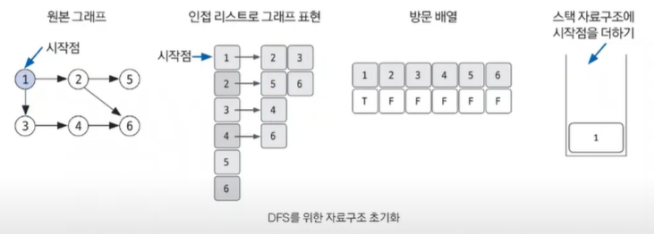
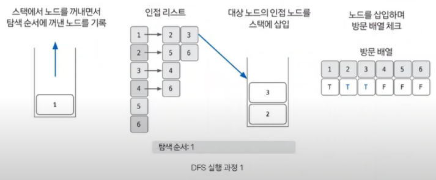
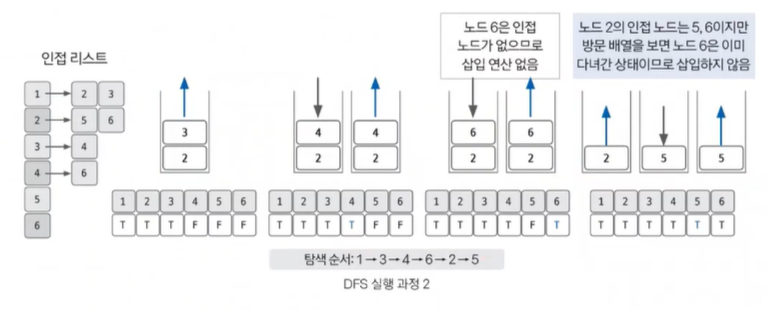
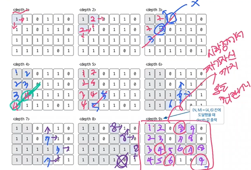

## 탐색

### ⭐ 깊이 우선 탐색 (DFS)

가장 많이 사용  

- 그래프 완전 탐색 기법
- 그래프의 시작 노드에서 출발하여 탐색할 한 쪽 분기를 정하여 최대 깊이까지 탐색 후 다른 분기로 이동
- 시간 복잡도 : O(V+E)
  - V : 노드 수
  - E : 에지 수
- 응용 문제 : 단절점 찾기, 단절선 찾기, 사이클 찾기, 위상 정렬

#### 특징
1. 재귀 함수로 구현
2. 스택 자료구조 이용 (FIFO)

스택 오버플로에 유의!  

#### 핵심 이론
- 한 번 방문한 노드를 다시 방문하면 안된다
- 방문 여부 체크하는 배열이 필요
- 그래프는 인접 리스트로 표현
- DFS 구현은 스택보다는 스택 성질을 갖는 재귀 함수로 많이 구현한다

#### 동작 방식

1. DFS 를 시작할 노드를 정한 후 사용할 자료구조(인접 리스트) 초기화하기
   - 인접 리스트로 그래프 표현하기
   - 방문 배열 초기화하기
   - 스택 자료구조에 시작점 삽입하기



2. 스택에서 노드를 꺼낸 후 꺼낸 노드의 인접 노드를 다시 스택에 삽입하기
   - pop 해서 인접 리스트 확인
   - 인접 노드를 스택에 삽입
   - 방문 배열에 체크 (F → T)

3. 스택 자료구조에 값이 없을 때까지 반복하기
   - 이미 다녀간 노드는 방문 배열을 바탕으로 재삽입하지 않는 것이 핵심!

<br>

### 너비 우선 탐색 (BFS)

- 그래프 완전 탐색
- 시작 노드에서 출발해 **시작 노드를 기준으로 가까운 노드를 먼저 방문**하면서 탐색
- FIFO 탐색
- Queue 자료구조 이용
- 시간 복잡도 : O(V+E)

#### 핵심 이론
1. BFS 를 시작할 노드를 정한 후 사용할 자료구조 초기화하기
   - 방문했던 노드는 다시 방문하지 않는다
   - 방문할 노드를 체크하기 위한 배열
   - 그래프를 인접 리스트로 표현
   - 탐색을 위한 큐
2. 큐에서 노드를 꺼낸 후 꺼낸 노드의 인접 노드를 다시 큐에 삽입하기
3. 큐 자료구조에 값이 없을 때까지 반복하기

<br>

### 이진 탐색

원하는 데이터 탐색 시 사용하는 가장 일반적인 알고리즘  
구현 및 원리가 비교적 간단하므로 많은 코딩 테스트에서 부분 문제로 요구하는 영역  

- 데이터가 **정렬돼 있는 상태**에서 원하는 값을 찾아내는 알고리즘
- 대상 데이터의 중앙값과 찾고자 하는 값을 비교해 데이터의 크기를 절반씩 줄이면서 대상 탐색
- 시간 복잡도 : O(logN)

#### 탐색 과정
1. 현재 데이터값의 중앙값 선택
2. 중앙값 > 타깃 데이터 : 중앙값 기준 왼쪽 데이터셋 선택
3. 중앙값 < 타깃 데이터 : 중앙값 기준 오른쪽 데이터셋 선택
4. 과정 1~3 반복, 중앙값 == 타깃 데이터일 때 탐색 종료

---

#### 11724

⭐ 연결 요소의 개수

```text
연결 요소의 개수 = 그래프 개수

노드의 최대 개수가 1000이므로 시간 복잡도 N^2 이하의 알고리즘은 모두 사용할 수 있다
연결 요소는 에지로 연결된 노드의 집합
한 번의 DFS 가 끝날 때까지 탐색한 모든 노드의 집합을 하나의 연결 요소로 판단 가능

방향성이 없다 → 양쪽 연결
인접 리스트에 양쪽 연결 모두 구현

일반적으로 1을 시작점으로 탐색

모든 노드 탐색 후 탐색 종료 → DFS 2회 수행 → 연결 요소 개수 2개
모든 노드를 탐색하는 데 실행한 DFS 의 실행 횟수 = 연결 요소 개수
```

```java
import java.io.BufferedReader;
import java.io.IOException;
import java.io.InputStreamReader;
import java.util.ArrayList;

public class Main {
    static boolean visited[];
    static ArrayList<Integer>[] A;

    public static void main(String[] args) throws IOException {
        BufferedReader br = new BufferedReader(new InputStreamReader(System.in));
        StringTokenizer st = new StringTokenizer(br.readLine());
        int n = Integer.parseInt(st.nextToken());
        int m = Integer.parseInt(st.nextToken());
        visited = new boolean[n + 1]; // 방문 배열, 0은 쓰지 않는다
        A = new ArrayList[n+1]; // 인접 리스트
        for (int i = 1; i < n+1; i++) {
            A[i] = new ArrayList<Integer>();
        }
        for (int i = 0; i < m; i++) {
            st = new StringTokenizer(br.readLine());
            int s = Integer.parseInt(st.nextToken());
            int e = Integer.parseInt(st.nextToken());
            A[s].add(e);
            A[e].add(s);
        }
        int count = 0;
        for (i = 1; i < n+1; i++) {
            if (!visited[i]) {
                count++;
                DFS(i);
            }
        }
        System.out.println(count);
    }
    
    private static void DFS(int v) {
        if (visited[v]) {
            return;
        }
        visited[v] = true;
        for (int i : A[v]) {
            if (!visited[i]) {
                DFS(i);
            }
        }
    }
}
```
<br>

#### 2178


```text
N, M 의 범위 확인하기
100 이면 시간 복잡도를 거의 생각하지 않아도 된다

최단 경로 찾기
DFS, BFS 모두 가능
1 로 연결되어 있다고 생각
```

```java
import java.io.BufferedReader;
import java.io.InputStreamReader;
import java.util.LinkedList;
import java.util.Queue;
import java.util.StringTokenizer;

public class Main {
   // 상하좌우 이동 표현
   static int[] dx = {0, 1, 0, -1};
   static int[] dy = {1, 0, -1, 0};

   static boolean[][] visited;
   static int[][] A;
   static int N, M;

   public static void main(String[] args) {
      BufferedReader br = new BufferedReader(new InputStreamReader(System.in));
      StringTokenizer st = new StringTokenizer(br.readLine());
      N = Integer.parseInt(st.nextToken());
      M = Integer.parseInt(st.nextToken());
      A = new int[N][M];
      visited = new int[N][M];
      for (int i = 0; i < N; i++) {
         st = new StringTokenizer(br.readLine());
         String line = st.nextToken();
         for (int j = 0; j < M; j++) {
            A[i][j] = Integer.parseInt(line.substring(j, j + 1));
         }
      }
      BFS(0, 0);
      System.out.println(A[N-1][M-1]);
   }

   private static void BFS(int i, int j) {
      Queue<int[]> queue = new LinkedList<>();
      queue.offer(new int[] {i, j});
      visited[i][j] = true;
      while (!queue.isEmpty()) {
          int now[] = queue.poll();
          for (int k=0; k<4; k++) { // 상하좌우 탐색
              int x = now[0] + dx[k];
              int y = now[1] + dx[k];
              if (x >= 0 && y>= 0 && x < N && y < M) { // 배열을 넘어가면 안되고
                  if (A[x][y]!=0 && !visited[x][y]) { // 0이어서 갈 수 업서거나 기방문한 곳이면 안됨
                      // 갈 수 있는 곳
                     visited[x][y] = true;
                     A[x][y] = A[now[0]][now[1]] + 1; // 핵심
                     queue.add(new int[] {x, y});
                  }
              }
          }
      }
   }
}
```
<br>

#### 1920

```text
N^2 보다는 빠른 알고리즘이 필요

정렬 & 이진 탐색 사용 → O(NlogN)
```
```java
public class Main {
   public static void main(String[] args) {
      Scanner sc = new Scanner(System.in);
      int N = sc.nextInt();
      int[] A = new int[N];
      for (int i = 0; i < N; i++) {
          A[i] = sc.nextInt();
      }
      Arrays.sort(A);
      int M = sc.nextInt();
      for (int i = 0; i < M; i++) {
          boolean find = false;
          int target = sc.nextInt();
          int start = 0;
          int end = A.length -1;
          while(start <= end) {
              int mid_index = (start+end)/2;
              int mid_value = A[mid_index];
              if (mid_value > target) {
                  end = mid_index - 1;
              } else if (mid_value < target) {
                  start = mid_index + 1;
              } else {
                  find = true;
                  break;
              }
              if (find) System.out.println(1);
              else System.out.println(0);
          }
      }
   }
}
```